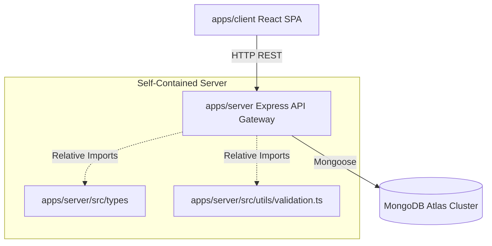

# AutoMatch Pro - Enterprise Coding Standards & Flow Documentation

This document provides a comprehensive guide to the codebase architecture, design patterns, coding standards, system flows, and function accessibility conventions of the AutoMatch Pro project.

---

## 1. Architectural Overview

AutoMatch Pro is structured as a monorepo comprising a React/Vite frontend client and an Express backend server. To ensure seamless deployments on platforms like Railway, all applications are fully self-contained.



### Folder Structure Directory Reference
*   **apps/client/**: React/Vite client application using Tailwind CSS and Axios.
*   **apps/server/**: Express core server handling database interactions, auth, logging, routing, and rule-based recommendations.
*   **apps/server/src/types/**: Consolidated TypeScript interfaces written directly in the server folder (no external packages/workspaces needed).
*   **apps/server/src/utils/validation.ts**: Helper functions and validation rules written directly in the server folder (no external packages/workspaces needed).

---

## 2. Core Coding Standards & Guidelines

### A. Directory Design Pattern (Separation of Concerns)
The server strictly adheres to the layered service-repository pattern:
1.  **Models Layer**: Mongoose schemas and entity typings.
2.  **Repository Layer**: Encapsulates raw database queries (isolation from services).
3.  **Service Layer**: Hosts business rules, validations, and scoring logic.
4.  **Controller Layer**: Handles Express request parsing, schema enforcement, and JSON responses.
5.  **Middleware Layer**: Intercepts requests for authentication, trace tracking, limiters, and error parsing.

### B. Standard Naming Conventions
*   **Class Names**: PascalCase (e.g., `CarRepository`, `AuthService`).
*   **Variable/Function Names**: camelCase (e.g., `generateRecommendations`, `matchUserWishlist`).
*   **TypeScript Types/Interfaces**: PascalCase, prefixed or suffixed appropriately (e.g., `Car`, `LoginRequest`).
*   **File Names**: PascalCase for React components (`App.tsx`), camelCase for utility modules (`security.ts`), and PascalCase for MongoDB models (`User.ts`).

### C. ESModules Runtime Imports
*   The backend server targets `NodeNext` ESModules. Because of this, all relative imports within backend files must explicitly include the `.js` file extension (e.g., `import { Car } from '../types/index.js'`).

### D. Downstream Error Handling
*   Never leak raw database stack traces to the client.
*   All controllers are wrapped in the `asyncHandler` decorator.
*   All application-level errors inherit or format into the unified API Error structure:
    ```json
    {
      "success": false,
      "code": "ERROR_CODE",
      "message": "User-friendly description",
      "errors": [],
      "traceId": "uuid-string"
    }
    ```

---

## 3. End-to-End System Flows

### A. Authentication Flow & Global Interceptor
*   **Client Login**: User submits login details -> server issues a JWT token.
*   **Stale Authentication Handling**: In `apps/client`, a global Axios response interceptor is configured to watch for `401 Unauthorized` responses. If a `401` occurs (e.g., DB restarts or tokens expire), the interceptor automatically clears stale tokens/profiles from localStorage and prompts the user with the login modal.

```
User (Client) -> Submit email/password -> AuthController.login()
  -> AuthService.login()
    -> Verify password via bcryptjs
    -> Sign short-lived Access Token (JWT)
    -> Sign long-lived Refresh Token (JWT)
    -> Return Access Token & User details
```

### B. Recommendation Flow
*   The recommendation service parses user preferences and scores candidate vehicles from the MongoDB database using a robust rule-based scoring mechanism (Max 100 Points):
    1.  **Budget Fit (Max 35 Points)**:
        - Price <= budget: **35 Points** if ratio >= 0.6; otherwise, `15 + Math.round(20 * (ratio / 0.6))` Points (minimum **15 Points**).
        - Price is between budget and `1.2 * budget`: scales down to `20 - Math.round(15 * excessRatio)` Points.
        - Price > `1.2 * budget`: **0 Points**.
    2.  **Seating Capacity Fit (Max 20 Points)**:
        - Seating matches family size exactly: **20 Points**.
        - Seating capacity exceeds family size: **15 Points**.
        - Seating capacity is lower than family size: **0 Points**.
    3.  **Priority Attribute Match (Max 25 Points)**:
        - **Safety**: 5-star NCAP = **25 Points**, 4-star = **18 Points**, 3-star = **10 Points**, lower = **3 Points**.
        - **Mileage**: `>= 22 km/l` = **25 Points**, `>= 18 km/l` = **20 Points**, `>= 15 km/l` = **12 Points**, lower = **5 Points**.
        - **Budget**: Price `<= 70%` of budget = **25 Points**, `<= 90%` = **20 Points**, `<= 100%` = **15 Points**, higher = **5 Points**.
        - **Performance**: EV/Electric OR cc `> 1600` OR Turbocharged = **25 Points**; cc `>= 1200` = **18 Points**; CC `< 1200` = **8 Points**.
    4.  **Fuel and Transmission Matches (Max 10 Points)**:
        - Fuel type matches preference (or preference is `Any`): **5 Points**.
        - Transmission matches preference (or preference is `Any`): **5 Points**.
    5.  **Brand Preference Match (Max 10 Points)**:
        - Manufacturer (make) matches brand preference: **10 Points**.
    6.  **Output Generation**: Persists the query in MongoDB and returns top recommendations along with clear reasons and trade-offs.

```
Client -> Submit Preferences -> RecommendationController.generate()
  -> RecommendationService.generateRecommendations()
    -> Fetch candidate vehicles from DB
    -> Pre-filter & Score candidate vehicles (Budget, Seating, Fuel, Transmission, Priority)
    -> Select top 5 candidates by business score
    -> Build rule-based recommendations (top 3 with reasons and trade-offs)
    -> Save recommendation history to MongoDB
    -> Return hydrated response to Client
```

### C. Review Flow
```
Client -> Open car detail modal -> GET /cars/:id/reviews
Client -> Submit review form -> POST /cars/:id/reviews (JWT required)
Client -> Delete own review -> DELETE /reviews/:id (JWT required, owner or admin)
```

---

## 4. How to Access and Run Code

### Monorepo Workspaces Management
From the project root directory, run commands:
*   **Build the entire monorepo**:
    ```bash
    npm run build
    ```
*   **Run development stack concurrently**:
    ```bash
    npm run dev
    ```
*   **Run database seed script**:
    ```bash
    npm run seed --workspace=@automatch/server
    ```
*   **Run backend integration and unit tests**:
    ```bash
    npm run test
    ```
