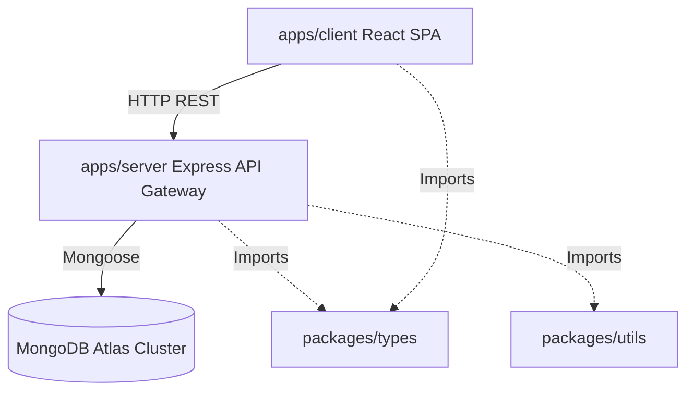

# AutoMatch Pro - Enterprise Coding Standards & Flow Documentation

This document provides a comprehensive guide to the codebase architecture, design patterns, coding standards, system flows, and function accessibility conventions of the AutoMatch Pro project.

---

## 1. Architectural Overview

AutoMatch Pro is structured as an **NPM Workspaces Monorepo** managed with TypeScript. The layout separates concerns between frontend client, API gateway, and shared logic.



### Folder Structure Directory Reference
*   **apps/client/**: React/Vite client application using Tailwind CSS and Axios.
*   **apps/server/**: Express core server handling database interactions, auth, logging, routing, and rule-based recommendations.
*   **packages/types/**: Shared TypeScript definitions (entities, DTOs, request payloads).
*   **packages/utils/**: Common sanitization, parsing, and validation utility modules.

---

## 2. Core Coding Standards & Guidelines

### A. Directory Design Pattern (Separation of Concerns)
The server strictly adheres to the layered service-repository pattern:
1.  **Models Layer**: Mongoose schemas and entity typings.
2.  **Repository Layer**: Encapsulates raw database queries (isolation from services).
3.  **Service Layer**: Hosts business rules, validations, and scoring logic.
4.  **Controller Layer**: Handles Express request parsing, schema enforcement, and JSON responses.
5.  **Middleware Layer**: Intercepts requests for authentication, trace tracking, limiters, and error parsing.

### B. Standard Naming Conventions
*   **Class Names**: PascalCase (e.g., `CarRepository`, `AuthService`).
*   **Variable/Function Names**: camelCase (e.g., `generateRecommendations`, `matchUserWishlist`).
*   **TypeScript Types/Interfaces**: PascalCase, prefixed or suffixed appropriately (e.g., `Car`, `LoginRequest`).
*   **File Names**: PascalCase for React components (`App.tsx`), camelCase for utility modules (`security.ts`), and PascalCase for MongoDB models (`User.ts`).

### C. Downstream Error Handling
*   Never leak raw database stack traces to the client.
*   All controllers are wrapped in the `asyncHandler` decorator.
*   All application-level errors inherit or format into the unified API Error structure:
    ```json
    {
      "success": false,
      "code": "ERROR_CODE",
      "message": "User-friendly description",
      "errors": [],
      "traceId": "uuid-string"
    }
    ```

---

## 3. End-to-End System Flows

### A. Authentication Flow
```
User (Client) -> Submit email/password -> AuthController.login()
  -> AuthService.login()
    -> Verify password via bcrypt.compare()
    -> Sign short-lived Access Token (JWT, 15 min expiry)
    -> Sign long-lived Refresh Token (JWT, 7 days expiry)
    -> Set Refresh Token as httpOnly, secure Cookie
    -> Return Access Token & User details
```

### B. Recommendation Flow
```
Client -> Submit Preferences Wizard -> RecommendationController.generate()
  -> RecommendationService.generateRecommendations()
    -> Fetch all candidate vehicles from DB
    -> Pre-filter & Score candidate vehicles (Budget, Seating, Fuel, Transmission, Priority)
    -> Select top 5 candidates by business score
    -> Build rule-based recommendations (top 3 with reasons and trade-offs)
    -> Persist recommendation log in MongoDB
    -> Map full vehicle details back to the response matching carIds
    -> Return hydrated response to Client
```

### C. Review Flow
```
Client -> Open car detail modal -> GET /cars/:id/reviews
Client -> Submit review form -> POST /cars/:id/reviews (JWT required)
Client -> Delete own review -> DELETE /reviews/:id (JWT required, owner or admin)
```

---

## 4. How to Access and Run Code

### Monorepo Workspaces Management
From the project root directory, run commands for specific workspaces:
*   **Build the entire monorepo**:
    ```bash
    npm run build
    ```
*   **Run development stack concurrently**:
    ```bash
    npm run dev
    ```
*   **Run seeding script**:
    ```bash
    npm run seed --workspace=@automatch/server
    ```
*   **Run specific tests**:
    *   Direct database validation: `npx.cmd tsx apps/server/src/utils/test_direct.ts`
    *   API routing integration check: `npx.cmd tsx apps/server/src/utils/test_api_endpoint.ts`
    *   Full endpoint suite: `npx.cmd tsx apps/server/src/utils/test_all_apis.ts`
