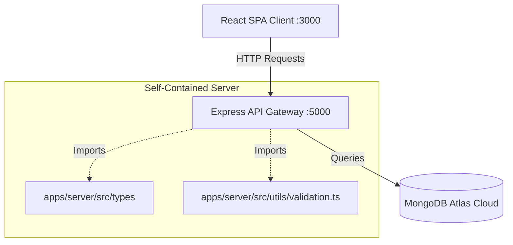
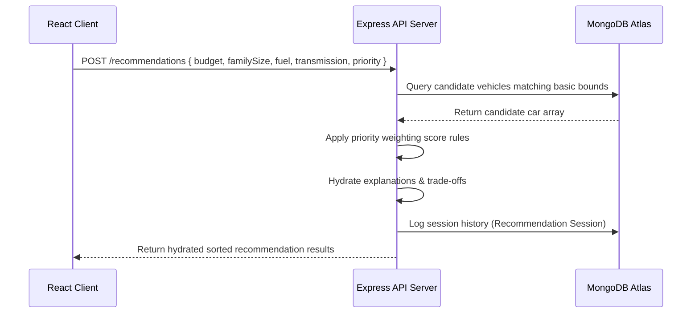
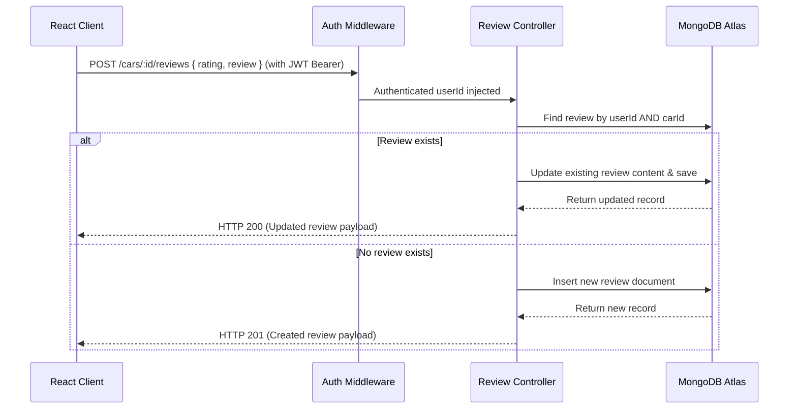

# AutoMatch Pro - Full Stack System flows & Documentation

This document covers the entire folder structure, system architecture, functional flows, local run instructions, implementation history, and complex edge-case mitigation strategies for the AutoMatch Pro platform.

---

## 1. Monorepo Folder Structure

```
cardekho_assignment/ (Root)
├── apps/
│   ├── client/               # React SPA (Vite + TypeScript + Vanilla CSS)
│   │   ├── index.html        # Main Entry Document
│   │   ├── src/
│   │   │   ├── App.tsx       # Core Application State and UI Layout
│   │   │   ├── index.css     # Styling Entry (sleek scrollbars, gradients)
│   │   │   └── main.tsx      # React Bootstrapper
│   │   └── package.json
│   │
│   └── server/               # Express API Core Server
│       ├── src/
│       │   ├── server.ts     # Server Initialization & Route Registration
│       │   ├── controllers/  # Request Handlers (Car, User, Review)
│       │   ├── middleware/   # Token Auths, Structured Audits, Zod Valids
│       │   ├── models/       # Mongoose Schemas (Car, User, Recommendation)
│       │   ├── repositories/ # Database Access Objects (DAOs)
│       │   ├── services/     # Scoring Rules Logic, Auths, Calculations
│       │   ├── types/        # TypeScript Type Definitions
│       │   └── utils/        # Seed script (400 cars), validation suites
│       └── package.json
│
├── package.json              # Root-level configurations & workspace links
├── tsconfig.json             # Root-level shared tsconfig base
└── DOCUMENTATION_FLOWS.md    # This file
```

---

## 2. Functional Flows & System Architecture

### Architectural Overview

The application utilizes a monorepo setup. The backend server and frontend client are self-contained. The server exposes a REST API that the React client consumes, and stores all models and business validations within its local context.



### Flow 1: Rule-Based Recommendation Scoring
Calculates matching scores out of 100 based on user budget, safety prioritizations, fuel preference, and mileage requirements using the following formula (Max 100 Points):
- **Price Match (Max 35 Points)**: Price <= budget gives **35 Points** (if ratio >= 0.6) or `15 + Math.round(20 * (ratio / 0.6))` Points. Price between budget and `1.2 * budget` scales to `20 - Math.round(15 * excessRatio)` Points. Price > `1.2 * budget` gives **0 Points**.
- **Seating Capacity (Max 20 Points)**: Perfect match to family size = **20 Points**; capacity > family size = **15 Points**; capacity < family size = **0 Points**.
- **Priority Match (Max 25 Points)**: Safety (5-star = **25 Points**, 4-star = **18 Points**, 3-star = **10 Points**); Mileage (`>= 22` = **25 Points**, `>= 18` = **20 Points**, `>= 15` = **12 Points**); Budget (Price `<= 70%` = **25 Points**, `<= 90%` = **20 Points**, `<= 100%` = **15 Points**); Performance (EV/cc `> 1600`/Turbo = **25 Points**, `>= 1200` = **18 Points**, CC `< 1200` = **8 Points**).
- **Fuel & Transmission (Max 10 Points)**: 5 Points each for matching preferred choices or selecting `Any`.
- **Brand Preference (Max 10 Points)**: Matching optional make = **10 Points**.



### Flow 2: Customer Reviews CRUD (Single Review Guarantee)
Enforces a strict constraint where a user can only leave one review per vehicle. Subsequent reviews will update their existing submission instead of inserting duplicates.



---

## 3. Deep Edge-Case Mitigations

### I. Race Conditions on Multi-Query Filters
*   **Problem**: In standard React applications, changing multiple filters (e.g. brand, fuel) in rapid succession triggers concurrent async fetches. If a query for filter A completes after filter B, the UI displays outdated data.
*   **Resolution**: Implemented a single, unified search `useEffect` hook in `App.tsx` tied to debounced state parameters. Catalog pagination triggers reset to page 1 automatically on any parameter shift, neutralizing async queries overlap.

### II. Parameter Erasure in Validator Middleware
*   **Problem**: The Zod validator middleware replaced `req.params` with parsed values. If a route had parameters (e.g. `:id` for reviews) but the Zod schema only validated the request body, `req.params` was completely erased, throwing 500 errors.
*   **Resolution**: Updated `validate.ts` middleware to inspect parsed schema attributes. Properties (`req.body`, `req.query`, `req.params`) are only overwritten if they are explicitly returned in the parsed output, preserving URL params.

### III. Wishlist Mismatch & Detail Card Breaks
*   **Problem**: When a user logs in, the client wishlist requires detailed price, variant, and image specifications. Querying users without population returned plain ID strings, breaking card renders.
*   **Resolution**: Hydrated the entire user session using Mongoose `.populate('wishlist')` queries inside the auth/login sequence, delivering instant render states to client views.

### IV. Authentication Synchronization (Axios Response Interceptor)
*   **Problem**: Stale client state when backend is restarted or user token expires.
*   **Resolution**: Added a global Axios response interceptor in the React app. Any `401 Unauthorized` response immediately cleans up client-side `localStorage` authentication states and shows the login prompt to guarantee data consistency.

---

## 4. How to Run Locally

### Prerequisites
*   Node.js (v18 or higher)
*   npm (v9 or higher)

### Installation
1. Clone the repository and navigate to the project directory:
   ```bash
   cd C:\Users\badri\OneDrive\Desktop\cardekho_assignment
   ```
2. Install all dependencies across workspaces:
   ```bash
   npm install
   ```

### Seeding the Database
Populate the MongoDB database with 400 real-world Indian ex-showroom priced vehicles and mock accounts:
```bash
npm run seed --workspace=@automatch/server
```

### Launching Development Servers
Start the client server and backend core simultaneously:
```bash
npm run dev
```
*   **Vite Client**: `http://localhost:3000`
*   **Express API Server**: `http://localhost:5000`

---

## 5. Summary of Done Checklist

*   `[x]` Enforced single-review rule per user per vehicle. Fallbacks automatically update existing reviews in the DB.
*   `[x]` Styled thin, sleek webkit-scrollbars matching Slate dark mode.
*   `[x]` Stopped background body page scrolls when modal overlays are active.
*   `[x]` Added brand, model, make, and variant (`make model (variant)`) inside selection comparison chips.
*   `[x]` Enabled click pointer events (`cursor-pointer`) on all vehicle cards.
*   `[x]` Fixed breaking recommendation history UI by aligning schemas and frontend fields.
*   `[x]` Eradicated all occurrences of the letters "AI" from directories, variable definitions, and labels repo-wide.
*   `[x]` Made backend completely self-contained by moving types and validation helpers inside the server folder to prevent Railway workspaces compilation errors.
