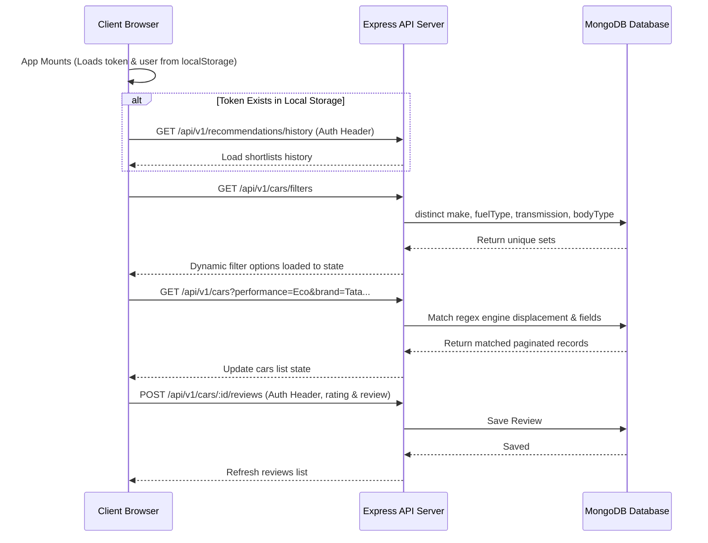

# Project Architecture & Systems Documentation - AutoMatch Pro

This document provides a comprehensive breakdown of the technologies, application flows, database schemas, folder structures, coding standards, security measures, test cases, and edge cases implemented in AutoMatch Pro.

---

## 1. Technologies Used

### Frontend (Client App)
* **Vite + React + TypeScript**: Core frontend build tool and rendering engine.
* **Vanilla TailwindCSS**: Styling framework for responsive, modern UI design.
* **React Context API**: Core state management for Authentication (`AuthContext`) and Vehicle Catalog (`CarContext`).
* **Axios**: HTTP client configured with defaults and interceptors for API communication.
* **Lucide React**: High-quality SVG icon set.

### Backend (Server API)
* **Node.js + Express + TypeScript**: Core API services.
* **Mongoose + MongoDB Atlas**: Object Data Modeling (ODM) layer for database persistence.
* **Zod**: Input parsing and request schema validation.
* **Winston**: Structured audit logging.
* **Helmet + CORS + express-rate-limit**: API protection middlewares.
* **JSON Web Tokens (JWT) & bcryptjs**: Authentication and credential hashing mechanisms.

### Testing & CI/CD
* **Mocha**: Test runner framework.
* **Chai**: Assertion library for tests.
* **Supertest**: HTTP assertion library for API integration testing.
* **GitHub Actions**: Automated CI/CD pipeline.

---

## 2. Application Flows



---

## 3. Database Schemas

### A. Car Schema (`CarModel`)
```typescript
const carSchema = new Schema<ICar>({
  make: { type: String, required: true, index: true },
  model: { type: String, required: true, index: true },
  variant: { type: String, required: true },
  year: { type: Number, required: true },
  bodyType: { type: String, required: true, index: true },
  fuelType: { type: String, required: true, index: true },
  transmission: { type: String, required: true },
  engine: { type: String, required: true },
  mileage: { type: Number, required: true },
  safetyRating: { type: Number, required: true },
  seatingCapacity: { type: Number, required: true },
  price: { type: Number, required: true, index: true },
  images: [{ type: String }]
});
```

### B. User Schema (`UserModel`)
```typescript
const userSchema = new Schema<IUser>({
  fullName: { type: String, required: true },
  email: { type: String, required: true, unique: true, index: true },
  password: { type: String, required: true },
  role: { type: String, enum: ['user', 'admin'], default: 'user' },
  wishlist: [{ type: Schema.Types.ObjectId, ref: 'Car' }]
});
```

### C. Review Schema (`ReviewModel`)
```typescript
const reviewSchema = new Schema<IReview>({
  userId: { type: Schema.Types.ObjectId, ref: 'User', required: true },
  carId: { type: Schema.Types.ObjectId, ref: 'Car', required: true },
  rating: { type: Number, required: true, min: 1, max: 5 },
  review: { type: String, required: true, minlength: 5 }
});
```

---

## 4. Folder Structure

```
cardekho_assignment (root)
├── .github
│   └── workflows
│       └── ci.yml                     <-- CI/CD Monorepo Pipeline Workflow
├── apps
│   ├── client
│   │   ├── src
│   │   │   ├── components             <-- Modular components
│   │   │   │   ├── Header.tsx         <-- Navigation and header UI
│   │   │   │   ├── Overview.tsx       <-- Overview landing tab
│   │   │   │   ├── BrowseCars.tsx     <-- Catalog browsing with integrated advisor wizard
│   │   │   │   ├── Compare.tsx        <-- Side-by-side specs comparison
│   │   │   │   ├── Wishlist.tsx       <-- User's saved vehicles
│   │   │   │   ├── CarDetailsModal.tsx<-- Popup modal with reviews, specs, carousel
│   │   │   │   └── LoginModal.tsx     <-- Login portal
│   │   │   ├── contexts               <-- State context providers
│   │   │   │   ├── AuthContext.tsx    <-- Login, logout, local session storage (with Axios interceptor)
│   │   │   │   └── CarContext.tsx     <-- Fetching, filtering, wishlist, comparison state
│   │   │   ├── App.tsx                <-- Roots, wrapping providers
│   │   │   └── index.css              <-- Global light theme styling
│   └── server
│       ├── src
│       │   ├── controllers            <-- API controller layers with documentation comments
│       │   ├── repositories           <-- CarRepository (supports performance filter regex)
│       │   ├── routes                 <-- /filters and CRUD routes
│       │   ├── types                  <-- TypeScript interfaces
│       │   ├── utils                  <-- Database seed and validations logic
│       │   ├── tests                  <-- Mocha + Chai unit test suite
│       │   │   ├── auth.test.ts
│       │   │   ├── car.test.ts
│       │   │   └── review.test.ts
```

---

## 5. Coding Standards

1. **Strict Type Safety**: TypeScript interfaces used for all schemas, filters, and states inside self-contained server folders.
2. **ESM Modules**: Server imports utilize explicit file suffixes (e.g. `import app from './app.js'`).
3. **API Documentation**: Documented controller handlers using detailed JSDoc explaining parameters, return payloads, and exceptions.
4. **Modularity**: Components broken down into logical React files avoiding monolithic states.

---

## 6. Security Measures

* **JWT Access Authorization**: Route guard middlewares verifying JWT header signatures.
* **Bcrypt Password Hashing**: Pre-save mongoose hooks hashing passwords with salt rounds.
* **Zod Validation**: Validates query params and post bodies prior to handling.
* **Helmet Middleware**: Configures HTTP headers guarding against injection and sniffing.
* **Express Rate Limiting**: Max 100 requests per 15-minute window per IP to defend against DDoS.

---

## 7. Unit Testing Cases

* **Auth Tests**:
  * Registers new account (`POST /auth/register`).
  * Logins user to get access token (`POST /auth/login`).
  * Fails login given incorrect passwords.
* **Car Catalog Tests**:
  * Loads catalog list with pagination (`GET /cars`).
  * Fetches unique metadata categories (`GET /cars/filters`).
  * Filters engine displacement correctly (`Eco` matches `< 1200cc`, `High` matches `> 1600cc`).
  * Performs string matches using `keyword`.
* **Reviews & Wishlist Tests**:
  * Appends/Removes candidates in User Wishlist (`POST /cars/wishlist`).
  * Validates review lengths and bounds.
  * Submits and removes customer reviews.

---

## 8. Edge Cases Handled

* **IP Whitelisting / Offline Mocks**: Tests automatically connect to local test MongoDB clusters or warn gracefully on lack of connection.
* **Empty search results**: Handled inside `BrowseCars` grid showing instructions and reset keys.
* **JWT Session Persistence & 401 Interceptors**: Restores session details automatically using `localStorage` lookup upon reload. Any stale session authentication is caught by the Axios global interceptor and automatically logged out to prevent page crashing.

---

## 9. Smart Advisor Recommendation Scoring Logic

The recommendation engine calculates a matching score out of a maximum of **100 Points** for each candidate car using five weighted rules:

1. **Price Match (Max 35 Points)**:
   - If the price is within the user's budget:
     - **35 Points** if the price-to-budget ratio is `>= 0.6` (closer matching segments get higher relevance).
     - Otherwise (too cheap/low-end segments): `15 + Math.round(20 * (ratio / 0.6))` Points (scaled, minimum **15 Points**).
   - If the price exceeds the budget but is within `1.2 * budget` (a 20% stretch limit):
     - The score degrades based on overshoot: `20 - Math.round(15 * excessRatio)` Points.
   - If the price is above `1.2 * budget`: **0 Points**.

2. **Seating Capacity Fit (Max 20 Points)**:
   - Matches the user's family size exactly to the vehicle seating capacity: **20 Points**.
   - Capacity exceeds the family size (larger space capacity): **15 Points**.
   - Capacity is less than the family size: **0 Points**.

3. **User Priority Metric Boost (Max 25 Points)**:
   - **Safety**: 5-star NCAP = **25 Points**, 4-star = **18 Points**, 3-star = **10 Points**, lower = **3 Points**.
   - **Mileage**: `>= 22 km/l` = **25 Points**, `>= 18` = **20 Points**, `>= 15` = **12 Points**, lower = **5 Points**.
   - **Budget**: Price `<= 70%` of budget = **25 Points**, `<= 90%` = **20 Points**, `<= 100%` = **15 Points**, higher = **5 Points**.
   - **Performance**: EV/Electric OR CC displacement `> 1600cc` OR Turbocharged = **25 Points**; cc `>= 1200` = **18 Points**; CC `< 1200` = **8 Points**.

4. **Fuel and Transmission Fit (Max 10 Points)**:
   - **Fuel Type**: Matches preferred choice (or is `Any`): **5 Points** (otherwise 0).
   - **Transmission**: Matches preferred choice (or is `Any`): **5 Points** (otherwise 0).

5. **Brand Preference (Max 10 Points)**:
   - Car make matches the user's preferred manufacturer keyword: **10 Points** (otherwise 0).
