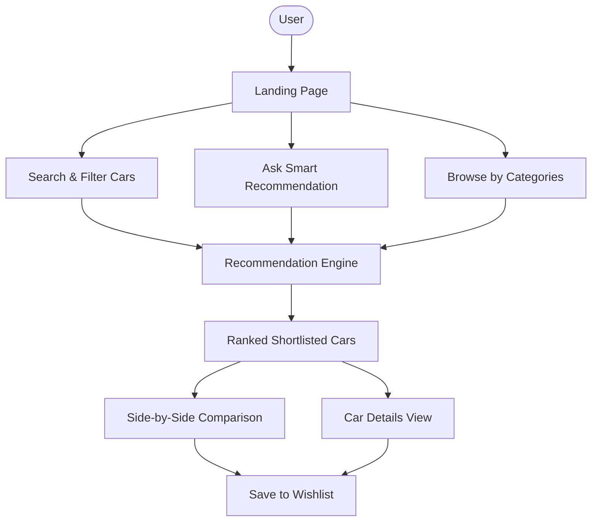
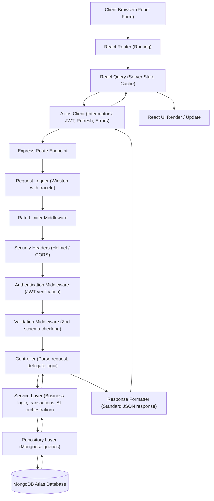
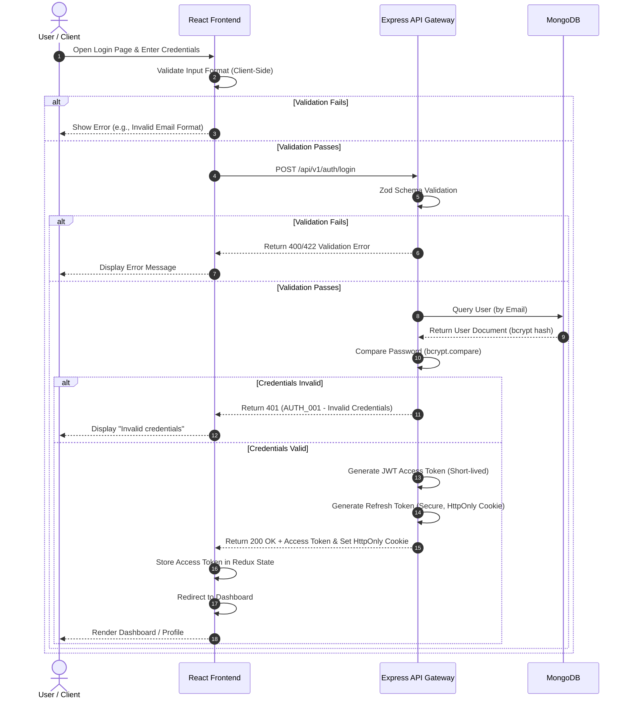
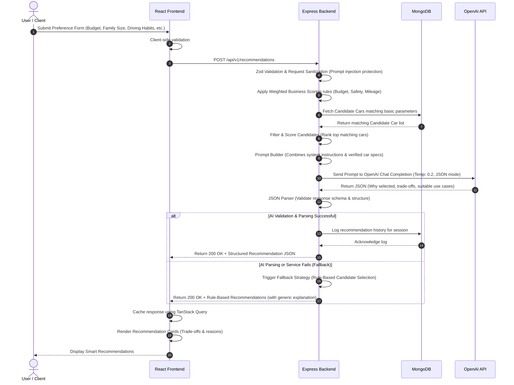
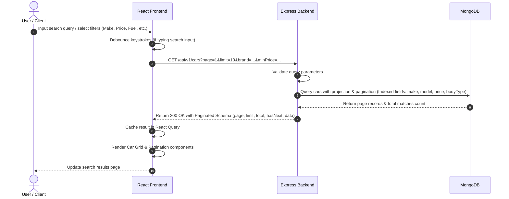
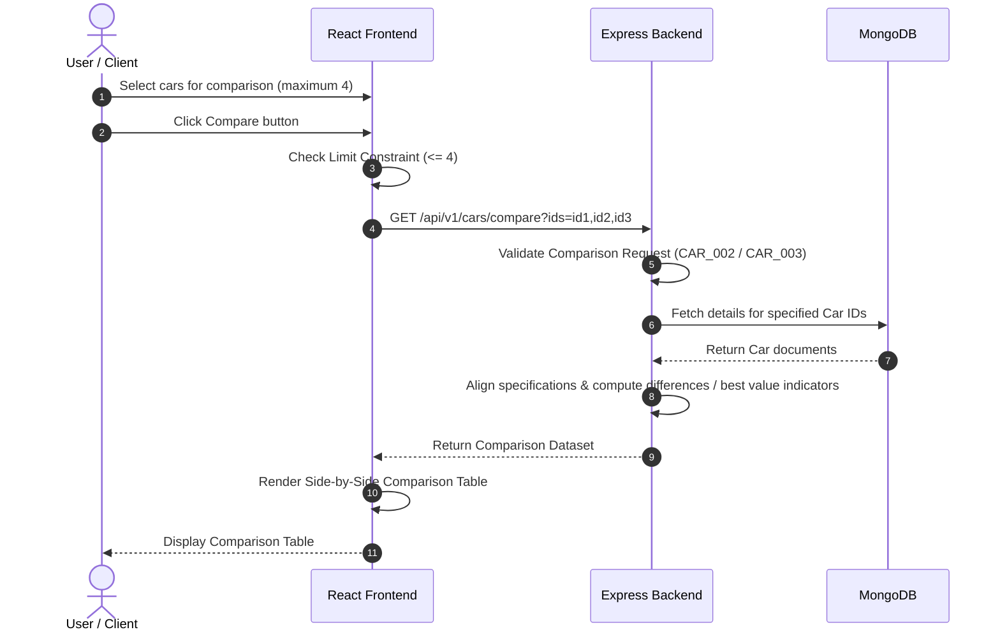
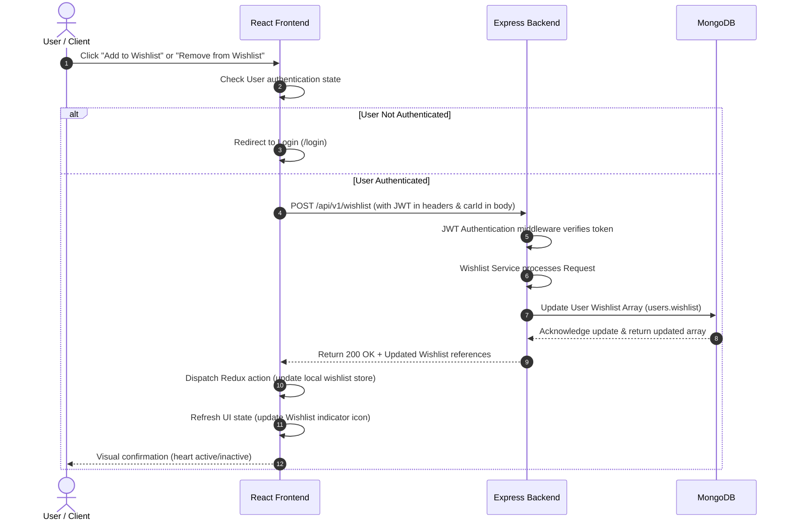
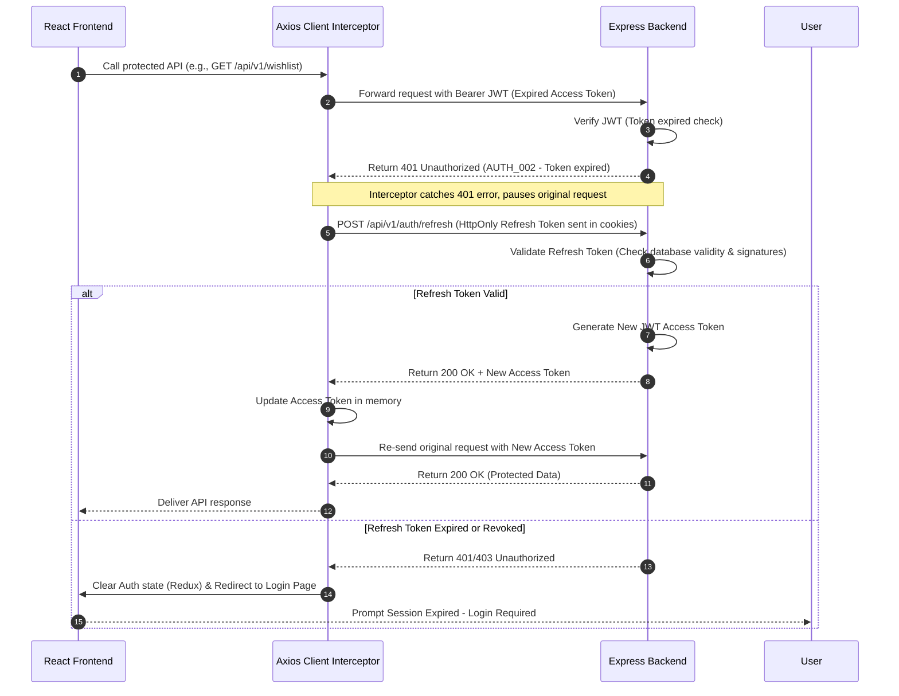
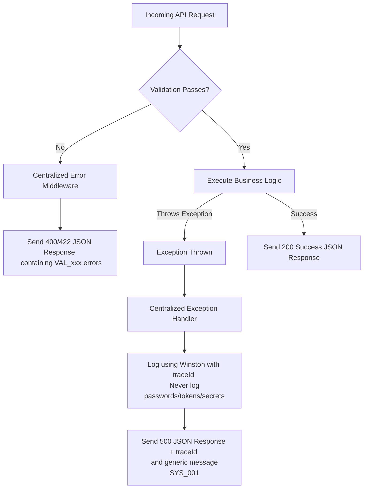
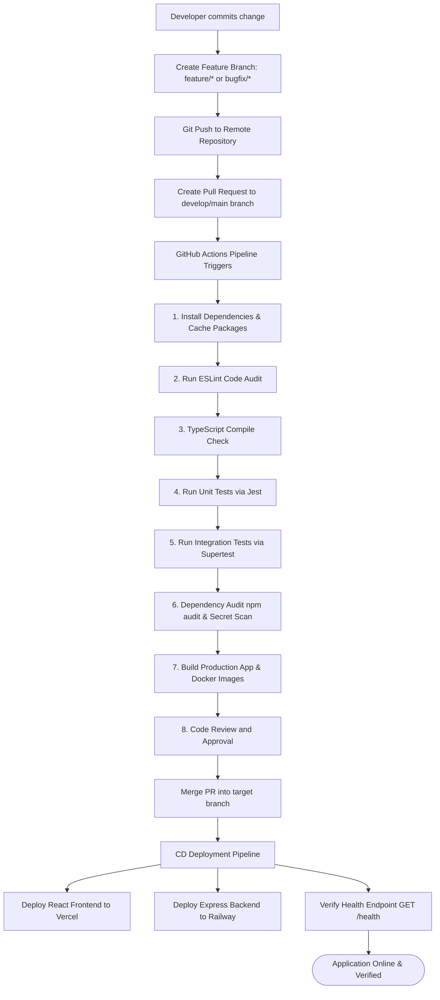

# AutoMatch Pro – Application Flows & Lifecycle Documentation

This document describes the end-to-end flows, pipelines, request lifecycles, and sequence diagrams for the **AutoMatch Pro** platform, compiled from the enterprise design and system documentation. It serves as a visual and descriptive reference for developers, testers, and architects working on the platform.

---

## Table of Contents
1. [Overall System Flow](#1-overall-system-flow)
2. [Request Lifecycle & Data Flow](#2-request-lifecycle--data-flow)
3. [Authentication Flow](#3-authentication-flow)
4. [Smart Recommendation Flow & Pipeline](#4-ai-recommendation-flow--pipeline)
5. [Search & Discovery Flow](#5-search--discovery-flow)
6. [Car Comparison Flow](#6-car-comparison-flow)
7. [Wishlist Flow](#7-wishlist-flow)
8. [Refresh Token Flow](#8-refresh-token-flow)
9. [Error Handling Flow](#9-error-handling-flow)
10. [Git Workflow & CI/CD Pipeline](#10-git-workflow--cicd-pipeline)

---

## 1. Overall System Flow
The overall system flow represents the main user paths through the AutoMatch Pro application, from entering the platform to finalizing their shortlisted cars.



---

## 2. Request Lifecycle & Data Flow
This details the lifecycle of a request as it passes from the client browser interface down to the database and back. All requests pass through standardized layers ensuring logging, security, authentication, and validation.



---

## 3. Authentication Flow
The authentication flow utilizes secure JSON Web Tokens (JWT) with short-lived access tokens and secure, HTTP-only refresh tokens.



---

## 4. Smart Recommendation Flow & Pipeline
AutoMatch Pro utilizes a hybrid recommendation strategy. Deterministic business rules score and filter candidate vehicles from the database *before* sending them to the Large Language Model (LLM). This optimization lowers API costs, speeds up performance, and prevents hallucinated specifications.



### Recommendation Input Variables:
- **Budget**: Maximum purchase price constraint.
- **Family size**: Determines seating capacity.
- **Usage & Daily distance**: Calibrates mileage and fuel preference weights.
- **Fuel preference**: Petrol, Diesel, Electric, or Hybrid.
- **Transmission**: Manual or Automatic.
- **Safety priority**: NCAP rating weights.
- **Mileage priority**: Fuel economy weight.
- **Brand preference (optional)**: Direct filter or score boost.

### Business Scoring Weight Weights:
- Budget Match: **30%**
- Safety Rating: **20%**
- Mileage: **15%**
- Fuel Preference: **10%**
- Transmission: **10%**
- Seating Capacity: **10%**
- User Preferences: **5%**

---

## 5. Search & Discovery Flow
Standard database search integrates keyword lookups, structured filtering, and server-side pagination utilizing indexing for rapid response times (< 500 ms target).



---

## 6. Car Comparison Flow
Allows users to compare up to 4 selected cars side-by-side, highlighting the differences and best values across core categories.



---

## 7. Wishlist Flow
Wishlist management is a protected workflow requiring JWT authentication. Changes are persisted directly to the User database record.



---

## 8. Refresh Token Flow
To maintain session security without sacrificing user experience, expired short-lived JWT access tokens are transparently refreshed using secure HttpOnly cookies.



---

## 9. Error Handling Flow
The backend error handling middleware isolates user-facing standard errors from internal exceptions, preventing server details and stack traces from leaking to the client.



### Standardized Error Format:
```json
{
  "success": false,
  "code": "AUTH_001",
  "message": "Invalid credentials.",
  "errors": [],
  "traceId": "req_123456789"
}
```

---

## 10. Git Workflow & CI/CD Pipeline
Continuous Integration and Deployment automated checks guarantee that no breaking changes, syntax failures, or credentials reach production.



---
*AutoMatch Pro Enterprise Flows Documentation Suite (v1.0.0)*
