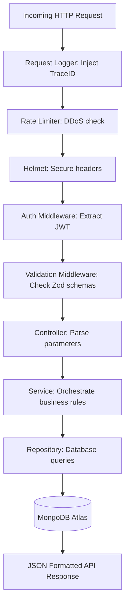
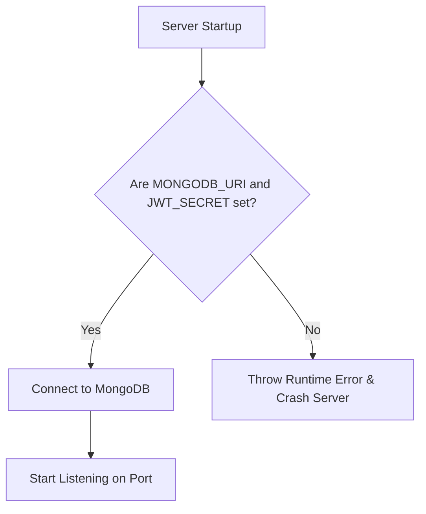

# Backend Architecture & Folder Structure

This document details the Node.js + Express backend server, outlining the role of each file, database schemas, environment variables configuration, and test suites.

---

## 1. Server Folder Structure & File Roles

The server code is structured using clean architectural layers (Repositories, Services, Controllers, and Routers) to isolate business logic:

```
apps/server/
├── Dockerfile               # Production docker container setup
├── package.json             # Workspace dependencies, scripts, & watcher rules
├── tsconfig.json            # Server TypeScript compilation configuration
├── src/
│   ├── app.ts               # Bootstraps Express application, CORS rules, and Rate Limiters
│   ├── server.ts            # Entry point checking MONGODB_URI & starting http server
│   │
│   ├── config/              # Server configuration
│   │   └── logger.ts        # Configures Winston logging layouts with trace IDs
│   │
│   ├── controllers/         # Handles incoming HTTP requests and responses formatting
│   │   ├── AuthController.ts # Logins, registrations, JWT generations
│   │   ├── CarController.ts  # Catalog retrievals, specs comparisons, dynamic filters
│   │   └── ReviewController.ts # Feedback creations, customer review deletions
│   │
│   ├── middlewares/         # Route intercepts and checks
│   │   ├── authMiddleware.ts # Checks JWT token validity & populates req.user
│   │   ├── errorMiddleware.ts # Formats standard exception responses
│   │   ├── requestLogger.ts  # Winston logging interceptor injecting traceId
│   │   └── validate.ts       # Express validator running Zod schemas
│   │
│   ├── models/              # Mongoose data structure schemas
│   │   ├── Car.ts           # Car schema specifying specs, safety, seating, and image lists
│   │   ├── Review.ts        # Customer review ratings and texts schema
│   │   └── User.ts          # User schema storing email, password, and wishlist ObjectIds
│   │
│   ├── repositories/        # MongoDB direct queries (Repository pattern)
│   │   ├── CarRepository.ts # Search catalogs, filter matching, dynamic filters
│   │   ├── ReviewRepository.ts # Customer review fetches, database review creations
│   │   └── UserRepository.ts # Query user by email, update wishlist ObjectIds
│   │
│   ├── routes/              # Modular Express routing entries
│   │   ├── index.ts         # Global routing hub mapping sub-routers & health checks
│   │   ├── authRoutes.ts    # Authentication endpoint routes mapping
│   │   ├── carRoutes.ts     # Catalog list, comparison, & wishlist endpoint routes
│   │   └── reviewRoutes.ts  # Add and delete reviews endpoint routes
│   │
│   ├── services/            # Business logic layer
│   │   ├── AuthService.ts   # Password encryption verify & login session creations
│   │   ├── CarService.ts    # Page parameter calculation & catalog search logics
│   │   └── ReviewService.ts # Review insertion validations & deletion permissions check
│   │
│   ├── tests/               # Mocha/Chai integration test suites
│   │   ├── auth.test.ts     # Tests login & signup validators
│   │   ├── car.test.ts      # Tests catalog, safety rating filters, & distinct options
│   │   └── review.test.ts   # Tests wishlist toggles, review additions & limits
│   │
│   └── utils/               # Database utilities
│       ├── check_images.ts  # Excluded check utility
│       ├── mockDb.ts        # In-memory database helper for tests
│       ├── seed.ts          # Database mock records seeder script
│       └── validation.ts    # Helper validation exceptions
```

### Detailed File Roles:
- **`server.ts`**: Verifies that environment keys are set, connects to the database via Mongoose, and starts the server.
- **`app.ts`**: Sets up express, cors, rate-limiters, helmet headers, Winston logger middlewares, global routes, and error middleware.
- **`logger.ts`**: Custom Winston logger writing console logs formatting timestamps, logs levels, and custom traceId payloads.
- **`authMiddleware.ts`**: Extracts JWT token from the Authorization header, validates it, and mounts the decrypted user payload to `req.user`.
- **`CarRepository.ts`**: Handles MongoDB database queries, using regex patterns for brands/keywords, pricing bounds checks, and safety/seating/year/mileage filters.

---

## 2. Request Lifecycle & Interceptors

This diagram shows how a request is processed through the server middleware pipeline:



---

## 3. Strict Environment Configuration

The backend is built with strict environment checks. Hardcoded fallbacks are forbidden:



---

## 4. Debugger & Auto-Rebuild Scripts
To enable rapid development:
- **Debugger**: Run `npm run debug` to launch the server with Node's inspector flag `--inspect=0.0.0.0:9229`. You can attach any chrome devtools or editor debuggers to step through code.
- **Auto-Rebuild**: Run `npm run build:watch` at the project root to run TypeScript compilers and frontend build watchers in parallel on every save.
