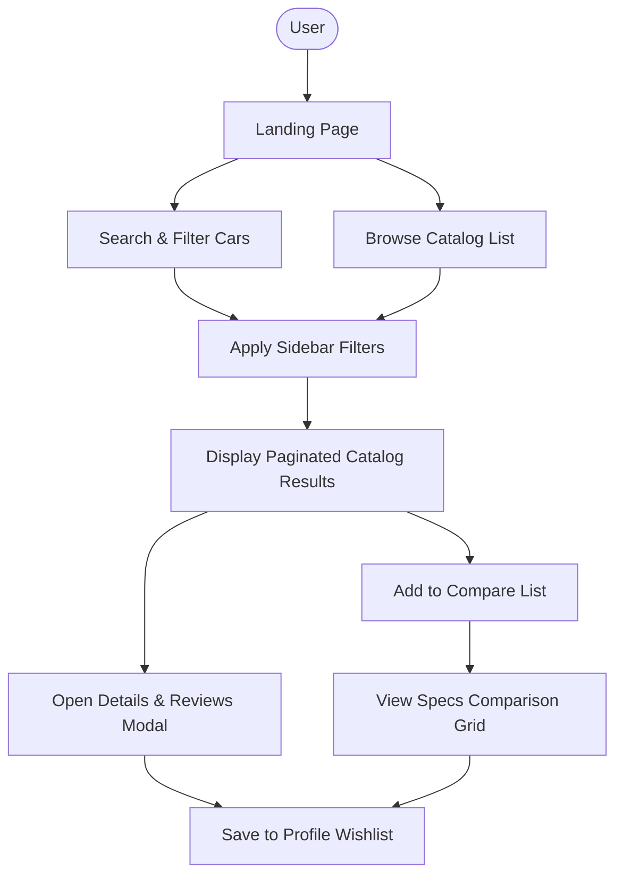
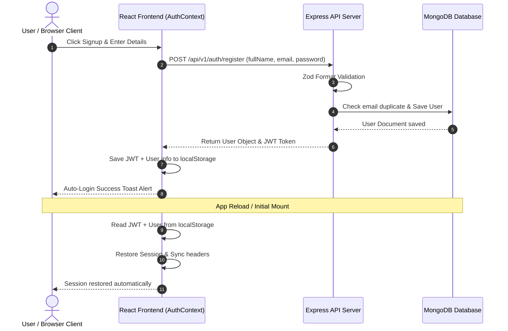
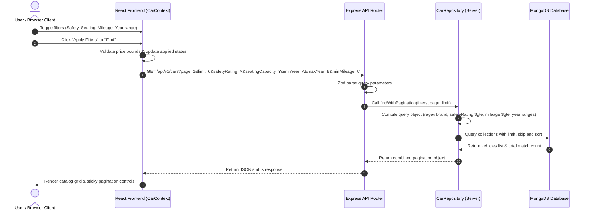
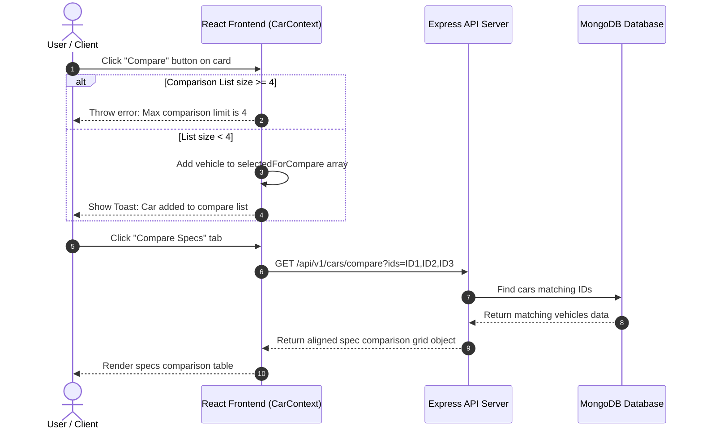
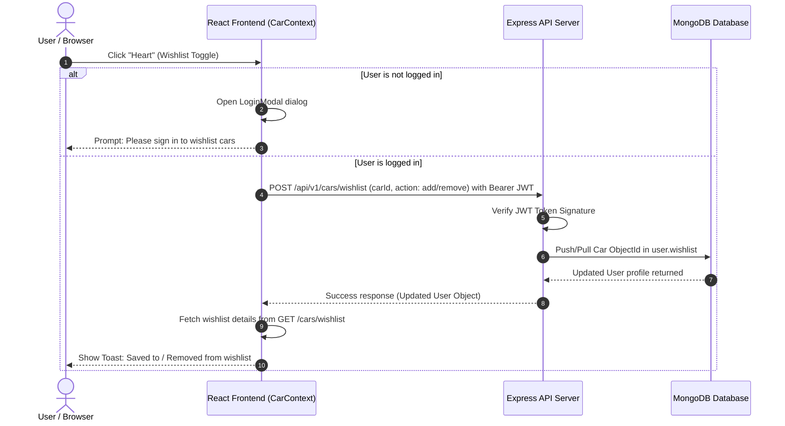
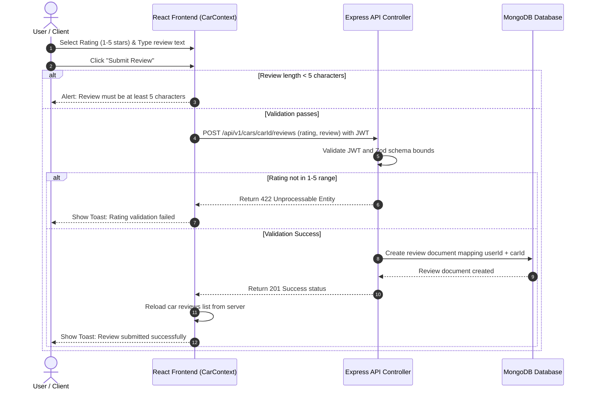

# Features & Application Flows

This document details the active features, validation rules, edge cases handled, and visual workflows implemented in the **AutoMatch Pro** platform.

---

## 1. Active Features Explanations

### A. Advanced Catalog Filtering & Keyword Search
To help buyers narrow down their selections, the catalog search is equipped with an advanced filters sidebar:
- **Brand (Make)**: Dynamically loaded brands dropdown options queried from distinct database values.
- **Model**: A dynamic models selector dropdown that is disabled by default. Once a user selects a Brand, the dropdown becomes active and is populated with *only* models belonging to that selected brand in the database collection (e.g., selecting 'Maruti Suzuki' shows 'Swift', while selecting 'Toyota' shows 'Fortuner'). This prevents users from selecting brand-model pairs that do not exist.
- **Fuel Type**: Quick selection tabs matching database fuel segments (Petrol, Diesel, CNG, Electric).
- **Transmission**: Filter options matching AMT, Manual, and Automatic transmissions.
- **Safety Rating**: Min NCAP Star threshold filter (3★+, 4★+, 5★).
- **Seating Capacity**: Filter vehicles based on passenger capacity (5 Seats vs 7 Seats).
- **Model Year Range**: Minimum and maximum year bounds selectors.
- **Mileage Slider**: Minimum mileage cutoff range slider (10 to 25 km/l).
- **Engine Performance**: Segmented displacement categorizer:
  - `Eco (<1.2L)` matches engines $< 1200cc$ and EV motors.
  - `Standard (1.2-1.6L)` matches mid-range engines.
  - `Sports (>1.6L)` matches engines $> 1600cc$.
- **Price Bounds**: Min and Max bounds fields (validated to prevent logical errors).

### B. Specifications Comparison Grid
- Enables side-by-side spec comparison for up to 4 selected vehicles.
- Gathers key specs (price, transmission, fuel, body type, engine CC, mileage, safety rating, seating) into a neat grid to assist users in finalizing their shortlists.

### C. Persistent Profile Wishlist
- Toggles items directly into the user profile database, replacing volatile client-side local storage.
- Wishlist cards display a solid indigo highlight indicator ("Selected") if they are currently added to the specifications comparison.

### D. Reviews & Feedback
- Logged-in users can write and delete comments with 1-5 star ratings for each car, which are instantly saved to the database.

### E. Custom Toast Alerts System
- A zero-dependency CSS animated slide-in popup notifications overlay informing users of login/signup successes, validation errors, and wishlist/comparison status updates.

---

## 2. Validation Rules & Handled Edge Cases

### A. Image Carousel Reset
- **Edge Case**: If a user views a car with 3 images, clicks to image index `2`, and then opens another car with only 1 image, the carousel crashes (out-of-bounds error).
- **Handling**: Added a reactive `useEffect` monitoring `selectedCar._id` that resets `currentImgIdx` to `0` whenever a new vehicle is selected.

### B. Price Bounds sanity checks
- **Edge Case**: Negative prices, or min price exceeding max price.
- **Handling**: Added state validation that outputs a warning message and disables filter submission.

### C. Zod Boundary checks
- **Edge Case**: Review ratings must be between 1 and 5 stars.
- **Handling**: Strict validation schemas in the backend using Zod (`z.number().min(1).max(5)`). Any invalid values trigger a structured `422 Unprocessable Entity` response, displayed as a Toast alert in the client.

### D. Initial Mount Race Conditions
- **Edge Case**: Token initialization delay on startup caused immediate page mounts to dispatch unauthenticated requests (resulting in 401 errors).
- **Handling**: Replaced implicit bearer tokens with explicit authorization header injection inside the data fetching callback functions.

---

## 3. Visual System Flow Diagrams

### A. Overall System Flow
The overall user journey from landing on the application to final shortlist comparison.

---

### B. Authentication & Signup Flow
Handles registration, login, JWT storage inside client local storage, and auto-login on mounting.

---

### C. Search & Catalog Query Flow
Detailed data propagation from catalog filter controls down to the MongoDB repository layer.

---

### D. Specifications Comparison Flow
Workflow for comparison list updates and spec grid fetching.

---

### E. Profile Wishlist Flow
Handles secure, authorized wishlist addition and database sync.

---

### F. Reviews Submission Flow
Validates ratings bounds and updates customer commentary records.

