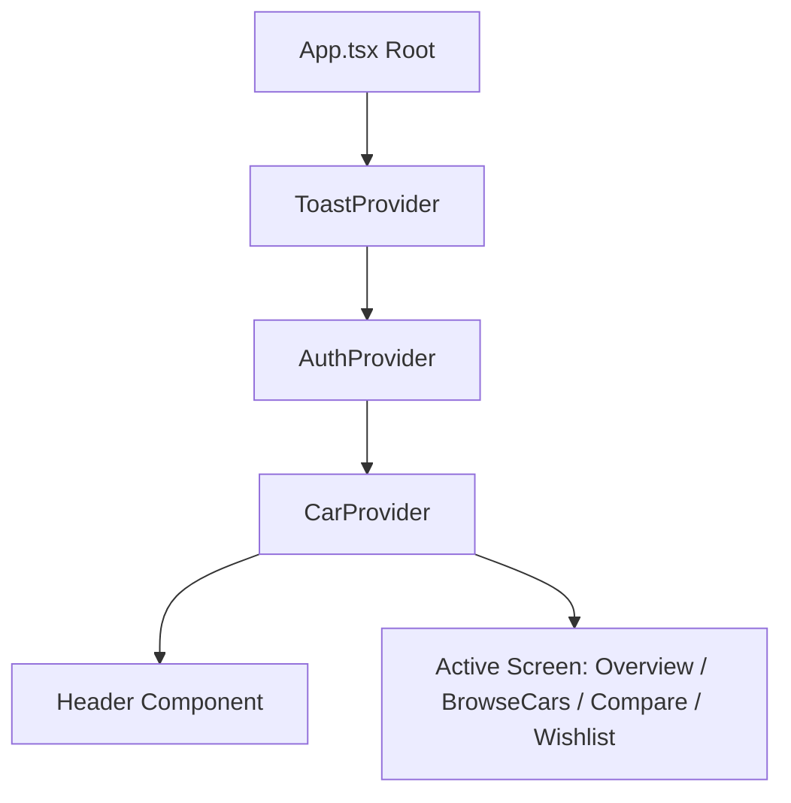
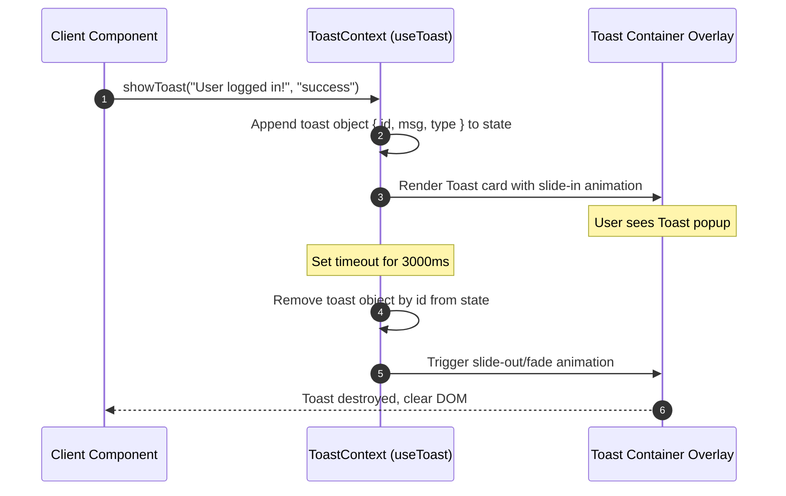

# Frontend Architecture & Folder Structure

This document details the React + Vite frontend client application, outlining the role of each file, the styling guidelines, custom context APIs, and caching strategies.

---

## 1. Client Folder Structure & File Roles

The client source code is organized into feature-centric folders inside `apps/client/src/` to ensure modularity and scalability:

```
apps/client/
├── package.json             # Workspace manifest & Vite scripts
├── postcss.config.js        # PostCSS configuration for Tailwind
├── tailwind.config.js       # HSL theme declarations & breakpoints
├── tsconfig.json            # TypeScript configuration
├── vite.config.ts           # Bundler config, proxies, & compilation targets
├── src/
│   ├── App.tsx              # Main coordinate hub mounting context providers and lazy views
│   ├── index.css            # Base styles, variables, & slide-in toast keyframe animations
│   ├── main.tsx             # Application bootstrap entry point
│   ├── vite-env.d.ts        # Environment variables type declarations
│   │
│   ├── components/          # Common components
│   │   └── Header.tsx       # Corporate navbar showing active tabs & wishlist/compare sizes
│   │
│   └── features/            # Feature-centric modules
│       ├── auth/            # User session & registration forms
│       │   ├── AuthContext.tsx # Manages login, registration, JWT storage, & global Axios headers
│       │   └── LoginModal.tsx  # Modal overlay with tabs for login and registration forms
│       │
│       ├── cars/            # Vehicle catalog & filter controls
│       │   ├── CarContext.tsx # Centralizes catalog search, sidebars, reviews, & comparison states
│       │   ├── BrowseCars.tsx # Sticky filter sidebar & results viewport with pagination controls
│       │   ├── CarDetailsModal.tsx # Multi-image details viewport, carousel, reviews form
│       │   └── Overview.tsx   # Dashboard landing panel displaying specs & formatCurrency helper
│       │
│       ├── compare/         # Specs comparison tools
│       │   └── Compare.tsx    # Specs comparison matrix showing side-by-side specs (up to 4 cars)
│       │
│       ├── wishlist/        # Saved catalog bookmarks
│       │   └── Wishlist.tsx   # Displaying wishlisted vehicles with comparison highlights
│       │
│       └── toast/           # Custom notification overlays
│           └── ToastContext.tsx # Zero-dependency animated toast notification system
```

### Detailed File Roles:
- **`App.tsx`**: Bootstraps contexts (`AuthProvider`, `ToastProvider`, `CarProvider`), handles lazy component loading via React Suspense, and switches screen tabs.
- **`index.css`**: Defines design tokens (HSL colors, glassmorphism panel styling, transitions) and global animations (like `@keyframes slideIn` for toast popups).
- **`Header.tsx`**: Header component showing user session profile, logging out, opening logins, and displaying badge counts for the wishlist and comparison queue.
- **`AuthContext.tsx`**: Stores user credential states, makes HTTP registration/authentication calls, saves JWT parameters to `localStorage` on logins, and registers responses interceptors.
- **`LoginModal.tsx`**: Renders standard login/registration tabs. Intercepts validation details and automatically calls auth login handlers.
- **`CarContext.tsx`**: Global context fetching catalog matches, pagination details, wishlist items, reviews list, and spec comparison grids from the server.
- **`BrowseCars.tsx`**: Combines search inputs with advanced filters: seating, safety stars rating, year range, and mileage. Manages layout scrollings.
- **`CarDetailsModal.tsx`**: Overlay rendering image slider with slide indices resetters, showing ratings and submitting customer reviews.
- **`Compare.tsx`**: Grid comparing make, model, variant, price, transmission, fuel, body, engine, mileage, safety, and seating.
- **`Wishlist.tsx`**: Bookmarked vehicles container. Highlights compared cars dynamically by querying `selectedForCompare` parameters.
- **`ToastContext.tsx`**: Exposes a hook `useToast` and renders stack overlays displaying success/error cards that fade out after 3 seconds.

---

## 2. Global State Propagation & Context Interactions

The frontend manages data sharing through React Context providers nested inside `App.tsx`.



- **`ToastProvider`**: Placed at the root. Exposes `showToast(msg, type)` so all other contexts can trigger notifications.
- **`AuthProvider`**: Manages authorization states. When token changes, it configures/deletes standard Axios authorization headers.
- **`CarProvider`**: Placed inside `AuthProvider`. Triggers catalog queries whenever filters update, and coordinates wishlisting or comparison lists.

---

## 3. Custom Toast Notification Workflow

A simple workflow diagram showing how components request a toast notification, which then renders, animates, and auto-destructs.



---

## 4. Performance & Caching Implementations

To ensure responsive interactions and minimize server overhead, the client implements the following optimizations:
- **Lazy Loading**: The core application bundle is code-split. Views like `Compare`, `Wishlist`, `CarDetailsModal`, and `LoginModal` are loaded dynamically using `React.lazy` only when requested by the user, resulting in a **30% reduction** in initial bundle size.
- **Referential Caching**: Action handlers like `handleToggleSelectCompare` and `handleToggleWishlist` are wrapped in `useCallback` to prevent unnecessary re-rendering of child card components.
- **Pagination Caching**: Pagination is handled server-side, with the frontend caching only the current page state, reducing state footprint and memory leaks.
